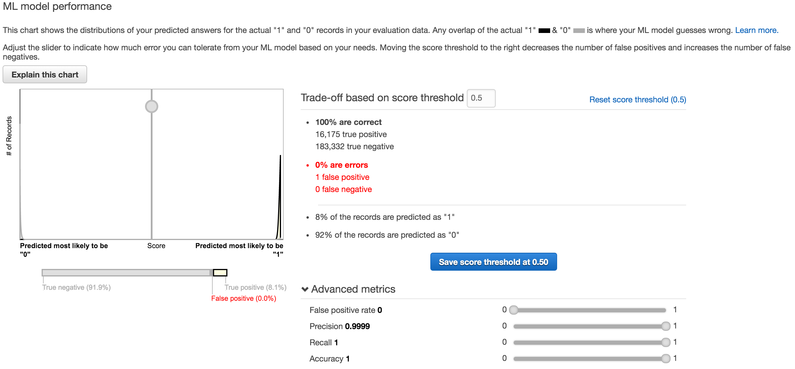

# Prime prediction using AWS Machine Learning
This is a project just for fun. Trying to predict primes using machine learning is a compelling case. The overall possibility to research number sequences using machine learning is also very interesting.

> If one could find features of primes an increased probability for prediction should be possible.

## Prerequisites
 - Nix environment with Git and Go.
 - Installed and configured the [AWS cli](http://docs.aws.amazon.com/cli/latest/userguide/cli-chap-getting-started.html).
 - Installed [primesieve](https://github.com/kimwalisch/primesieve).

## Data generation
Primes were generated using [primesieve](https://github.com/kimwalisch/primesieve). See [data/generate-primes.sh](https://github.com/gurre/ml-predict-prime/blob/master/data/generate-primes.sh).

```
# You may curl the binary from the releases page and skip all this
git clone https://github.com/gurre/ml-predict-prime
cd ml-predict-prime
# Generating the training data takes a while.
go run make-training-set.go --json=verbosetrainingset.json --csv=trainingset.csv
```

### Preparing the data
```
# Shuffle the rows
cat trainingset.csv | awk 'BEGIN{srand();}{print rand()"\t"$0}' | sort -k1 -n | cut -f2- > shuftrainingset.csv
```

## Attempt 1



> On your most recent evaluation, the ML model's quality score is considered suspiciously good (too good to be true?) for most machine learning applications.

So that sucks. It's obvious something wrong with the training data. If we already have the Nfactors we have done the work to determine if it's a prime. Why predict?! Futhermore Twin, Triplet, Quad, Penta and Sexy already says it's prime! Fail. Back to the drawing board.

### Lessions learned

 - Don't use redundant features.


## Attempt 2

Work in progress
