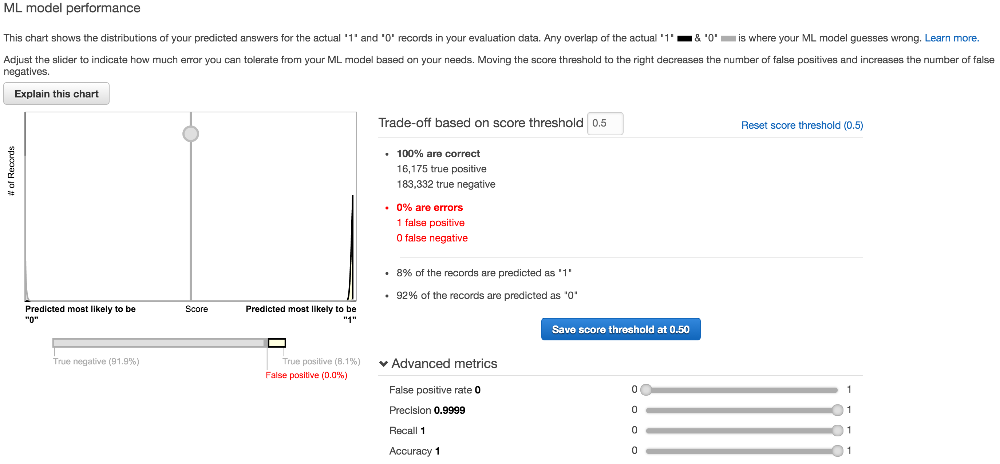

# Attempt 1

> On your most recent evaluation, the ML model's quality score is considered suspiciously good (too good to be true?) for most machine learning applications.

So that sucks. It's obvious something wrong with the training data. If we already have the Nfactors we have done the work to determine if it's a prime. Why predict?! Futhermore Twin, Triplet, Quad, Penta and Sexy already says it's prime! Fail. Back to the drawing board.

## Lessions learned

 - Don't use redundant features.
